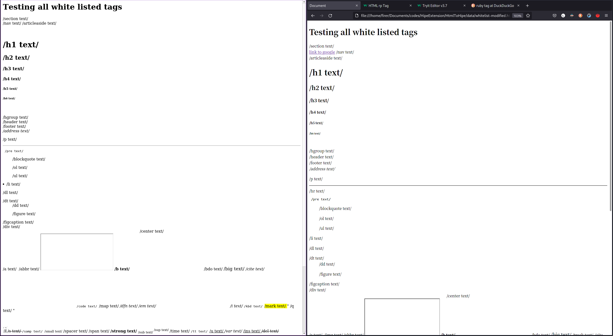
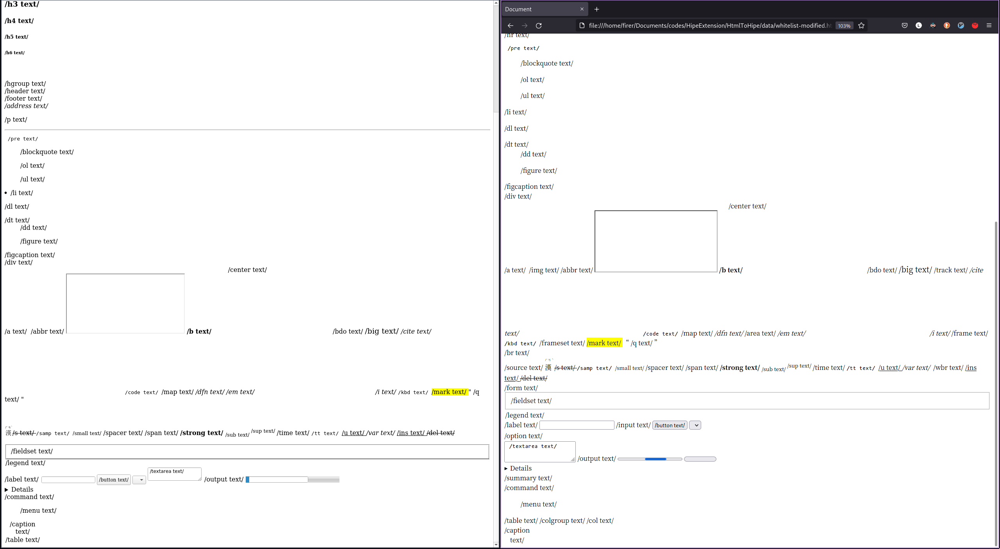

# Report of examples under `HtmlToHipe/data`

Author: Di Liu

## First Attempt <2021-09-05 Sun>

### Compilation Result

``` bash
╰─>$ make
gcc flex-grid.c -o flex-grid -lhipe
flex-grid.c: In function 'hipe_build_html_body':
flex-grid.c:93:9: error: expected declaration or statement at end of input
   93 |         hipe_send(session, HIPE_OP_SET_ATTRIBUTE, 0, loc, 2, "class", "flexbox");
      |         ^~~~~~~~~
make: *** [Makefile:13: flex-grid] Error 1
```

Reason: the close curly bracket does not generated for function `hipe_build_html_body`.
All code after bracket is also not generated.

[](./source/flex-gird.c)


### `media`

* Vides Player Test is correctly displayed, but cannot be played.


* some message from `hiped` after exit.

```bash
(hiped:33057): GStreamer-CRITICAL **: 15:47:34.873: gst_bin_get_by_name: assertion 'GST_IS_BIN (bin)' failed
```


### `whitelist-modified`

**
``
check `whitelist-modified.html` to observe the behaviour**

- `nav`
    unlike firefox, not break line ; no `<a>` inside
- `hr`
    break line, not display text
- `img`
    not working, not display either an empty box nor text, may becuase nothing inside
- `track`
    empty line, may because nothing inside
- `iframe` 
    an empty box, seems working correctly
- `video`
    an empty paragraph with line break, seems working correctly
- `canvas` `svg`
    an empty section without line break, seems working correctly
-  `area` `frame` `frameset` `caption` `source` 
    not working
- `wbr`
    unsure, no text displayed, may because the incorrect usage of the tag.
- `br`
    Note: does break the line, but text inside didn't shown
- `table` related tags
  - WARN: `thead` `tbody` `tfoot` `th` `tr` `td` is broken
    **The orignal result will stay in about 0.5 second**
    **Then the page will erase other elements, hence break the whole page.**
     May casued by incorrect translation or underlying webkit.
     Note: above example tag `a` nested inside `nav` also does not working properly.



